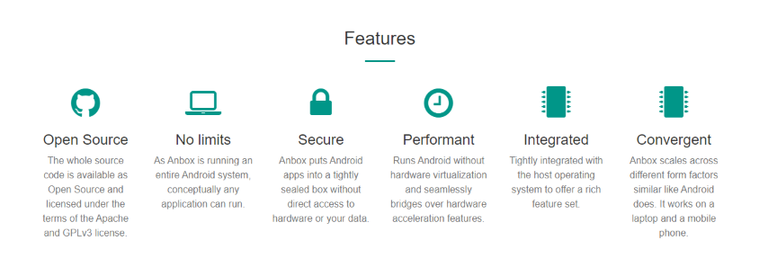

# Linux生态的补足：Anbox

>“要用魔法打败魔法。”  
----老爹

## 前言

众所周知，Linux开源而免费，与之相对的Windows抑或是macOS则是闭源而收费。经过长期的发展，闭源的Windows与macOS得益于稳定的用户群体保障了软件开发者的盈利而收获了良好的软件生态，而开源的Linux则因为没有稳定的用户群体与盈利保障而少有软件为之适配。

想要弥补Linux的生态？思路有两种，其一是用开源的[Wine](https://www.winehq.org/)在Linux上运行Windows程序，另一则是今天要说的[Anbox](https://github.com/anbox/anbox)。遗憾的是当前Anbox只官方支持Ubuntu，而在这里我也仅仅是记录这个项目。

## 简介

官方介绍，在这里大致翻译就是，“Anbox将Android系统放入容器（可能是虚拟机之意），模拟硬件访问并将Android系统的核心系统服务嵌入到Linux当中，同时每一个安装的App都会如Linux原生应用一样显示在Linux系统当中”。

官方给出了如下特征介绍，非常明了，也不一一翻译了

## 使用

由于早年间就脱离了Ubuntu的折磨转移到了Arch系，也确实没有实际上手折腾过这一项目

贴出来[官方的指导文档](https://docs.anbox.io/index.html)，在这里先挖个坑，等有空试着回Ubuntu折腾看看效果

官方也说了，只要是GNU/Linux平台都可以运行，不过可能需要对Linux系统比较高的理解了，官方明确说了要安装一些内核模块，继续挖坑，有空一定折腾看看

本文姑且先到此结束了🤣
