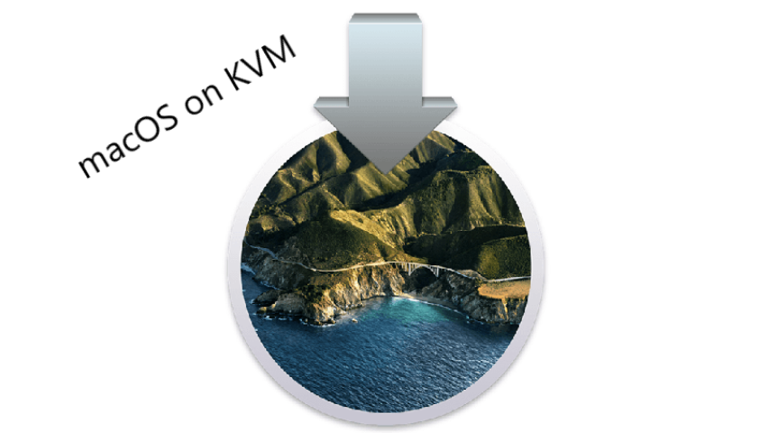

# 尝试写一个博客💌

欢迎来到一个纯记录好玩黑科技的博客，界面简陋，但是干货多多！

## [使用QEMU虚拟机加KVM虚拟化在Linux平台部署黑苹果]()

真正的折腾永远不会只停留在安装Linux，而是，比如说在Linux上跑macOS...

## [Linux生态的补足：Anbox]()

想要摆脱对Windows的依赖，目前的选择只有类Unix，显然macOS ~~只能~~ 跑在Mac上，那么最亲民的选择只有Linux了，但是Linux生态可以说是十分简陋了，用开源补一补开源，于是想到了Android...

## 