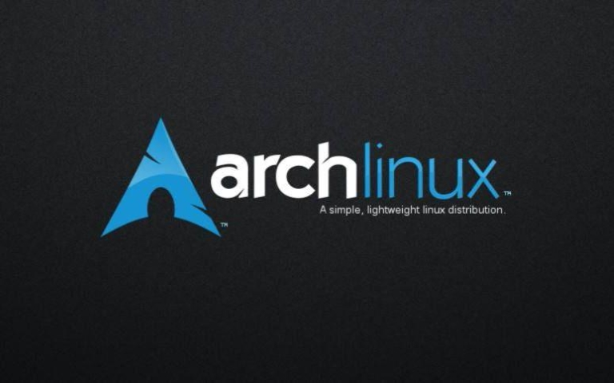

# 尝试写一个博客💌

欢迎来到一个纯记录好玩黑科技的博客，界面简陋，但是干货多多！

## [使用QEMU虚拟机加KVM虚拟化在Linux平台部署黑苹果](./macos.md)

有的人用macOS是因为需要使用如FinalCutProX这样的软件进行内容创作，有的人用macOS是因为macOS下有易于破解的Adobe软件，而有的人用macOS纯粹为了折腾...

## [从认识Linux到“Arch，决定是你了！”](./arch.md)

最开始接触到的Linux是Ubuntu，奈何具有“超级牛力”的APT包管理器需要手动添加PPA让人头皮发麻。后来认识了Arch，发现原来还有一个Pacman包管理器可以解决所有软件安装问题，于是踏入了Arch系的深水...

## [如何科学高效地安装Arch](./install.md)

社会在不断进步，时间对于每一个人来说都变得越来越宝贵，这时我们愈发强调效率。而Arch的安装是出了名的耗时间，那么如何科学高效地安装Arch值得我们去思考...

## [Linux生态的补足：Anbox](./anbox.md)

想要摆脱对Windows的依赖，目前的选择只有类Unix，显然macOS ~~只能~~ 跑在Mac上，那么最亲民的选择只有Linux了，但是Linux生态可以说是十分简陋了，用开源补一补开源，于是想到了Android...

## [政治学通识复习：导论](./政治学通识导论.md)

