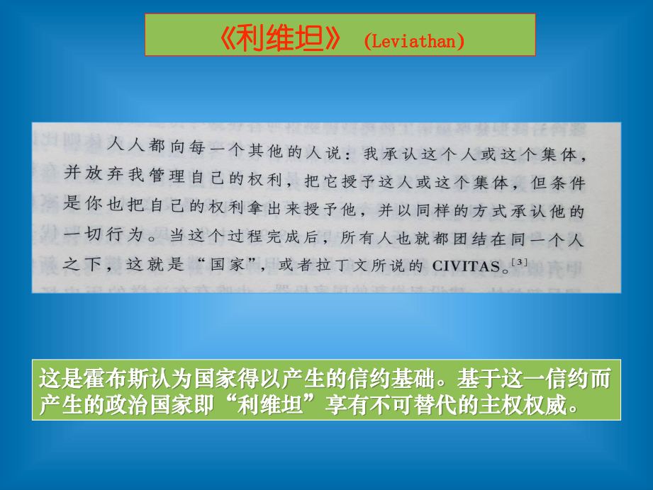

# 国家理论：传统框架与新挑战

>问题1：  
>如何理解“国家”？

1. 国家是什么？

2. 国家是怎么产生的？

3. 国家会不会被另外一种组织形式所替代？

4. ......

## “国家”是什么？

简单地说，国家(the state)作为一个政治概念，就是指在确定的领土边界内建立最高管辖权（主权）并通过一系列持久性机构（制度）实施权威的政治共同体。

通常用国家构成三要素（或四要素），即人民(population)、领土(territory)和主权(sovereignty)/（+政府（government))来概括国家的特点。

由于国家是主要负责共同体生活的集体性组织，由公共开支提供经费，所以也被认为是“公共的”。

德国社会学家马克斯.韦伯将国家界定为
**“拥有合法使用暴力的垄断地位”的实体**。这一论断对国家概念的理解影响深远。

围绕国家角色、国家权力的性质的争论，可以说是政治学以及政治哲学的核心问题。

### 英国伦敦经济学院帕特里克·邓利维(Patrick Dunleavy)将国家的特征归纳为11个方面

1. 它是互相联系的一系列有组织的制度，通常用“统一”来描述其行为特点；

2. 它的各项制度在一定的居民组成独特“社会”的地域空间之内得以运转；

3. 它的各项制度的功能在于制定有关“社会”成员事务的决策并使成员共同服从；

4. 它的存在形成了—个“公共”领域以区别于“私人”领域的活动或决策；

5. 它拥有凌驾于其他社会制度之上的主权(sovereignty)，有效地垄断了在该地域之内合法运用武力的权力；

6. 它以其所辖地域为基础，界定社会成员和非社会成员，控制人口的进出；

7. 它提出强烈的意识形态或道德诉求，以促进社会成员的共同利益或普遍意志；

8. 它得到了社会主要团体或成员的合法性认可；

9. 它掌握官僚资源以便能够征集税收，推动政务有效运转；

10. 它通过法律手段约束社会行为，通过宪法手段规制政府活动；

11. 它得到了其他国家的承认。

## 国家是怎么产生的？

+ 社会共同体说

+ 国家契约说

+ 马克思主义国家观

+ ......

### 社会共同体说

1. 古希腊的亚里士多德：国家是许多家族及村落的联合体，目的是为了达到完美而自治的生活。

2. 古罗马的西塞罗：国家是由许多社会团体，基于共同的权利意识及利益互享的观念结合而成的组织体。

3. 19世纪的德国哲学家康德：“国家是许多人依据法律组织起来的联合体”。

4. 当代西方政治学家：国家通常都是被看作特定社会生活共同体。

### 国家契约说

关于国家的社会契约观点，发源于古希腊的思想家伊壁鸠鲁。16—18世纪，政治学家如格老秀斯、斯宾诺莎、霍布斯、洛克、卢梭等人从自然法的角度完善了社会契约学说。约翰.罗尔斯等现代理论家关于正义的讨论又使其获得复兴。

社会契约学说认为，在国家产生以前人们处于自然状态中，拥有与生俱来的自然权利，由于自然状态下生活的不方便或不安全，人们相互订立社会契约，交出自己的部分权利，由此组成国家，人类摆脱自然状态而进入国家状态。所以，国家是人们通过社会契约建立的社会组织。

*社会契约从未被看作历史的真实行动，确切而言，它是用来展示政府的价值与政治义务之基础的手段。*

社会契约论的典型形式有三个要素：

+ 确定一个假设中的无国家社会的图景
**（自然状态）**。不受限制的自由意味着生活的“贫穷、孤独、肮脏、残忍和短命（霍布斯）。

+ 个人通过达成契约来逃避自然状态，认识到只有至高无上的主权权力才能保障**秩序与稳定**。

+ 社会契约迫使公民**尊重并服从**国家，最终对只有政治统治制度才能带来的稳定与安全怀有感激之情。

### 马克思主义国家观

**马克思主义认为，国家是社会分工和私有制的产物。**

原始社会末期，由于社会分工、私有制和阶级的产生，使人类社会第一次出现了巨大的利益分化和利益对立。面对社会利益结构和利益关系的这种变化，氏族社会的原有公共权力及其组织设施制度已失去了原有的社会共同利益基础，又不能胜任维护奴隶主阶级利益、协调新的利益矛盾的政治作用。在这种情况下，奴隶主阶级为了维护和实现自己的利益，镇压和控制奴隶阶级的反抗，协调其他利益矛盾，需要一种新的、不同以往的“特殊的公共权力”，国家即是这种新的公共权力组织。

因此，恩格斯指出：

>“国家是社会在一定发展阶段上的产物；国家是表示：这个社会陷入了不可解决的自我矛盾，分裂为不可调和的对立面而又无力摆脱这些对立面。而为了使这些对立面，这些经济利益互相冲突的阶级，不致在无谓的斗争中把自己和社会消灭，就需要有一种表面上驾于社会之上的力量，这种力量应当缓和冲突，把冲突保持在‘秩序’的范围以内；这种从社会中产生但又自居于社会之上并且日益同社会相异化的力量，就是国家”。  
>——恩格斯（《马恩选集》第4卷，第170页）

#### 其一,关于国家起源问题的理解

政治现象的起源，包括三个内容：

+ 阶级的产生；

+ 国家的产生；

+ 官员的产生

强调政治现象的产生是一个整体；

突出强调政治现象产生的同时，淡化了“国家的消亡”。

#### 其二，关于国家消亡的问题

国家和阶级一样，都是一个历史范畴。它随着阶级的产生而产生，也将随着阶级和阶级差别的的彻底消灭而自行消亡。**国家消亡是一个过程**，是逐步实现的。

1. 国家和阶级一样，都是一个历史范畴。它随着阶级的产生而产生，也将随着阶级和阶级差别的的彻底消灭而自行消亡。国家消亡是一个过程，是逐步实现的。

2. 国家决不能凭主观愿望随便废除，它什么时候消亡，要取决于一定的时间和条件，只有当客观条件具备时，国家才能自行消亡。

国家的消亡需要具有以下条件：

+ 从经济上看，国家完全消亡的经济基础就是共产主义的高度发展；

+ 从政治上看，在国内，彻底消灭阶级和阶级差别，在国际上，造成了没有一切剥削制度的新世界；

+ 从精神上看，全体人民具有高度的共产主义思想觉悟和道德品质。

+ 马克思主义认为：国家消亡只有通过无产阶级专政才能实现。

>国家是一种特殊的公共权力。  
>——恩格斯

国家是阶级统治的机关，但同时也是一种公共权力。

***

>问题2：  
>如何理解“国家角色”？

1. 对国家职能的基本分类

2. 对国家角色的不同解释框架

3. ......

## 对国家职能的基本分类

基本解释框架：

+ 国家职能是指国家活动的基本方向和主要内容，它所回答的是国家的使命和目的问题。

+ 斯大林的划分方法

  + 国家职能一般分为对内职能和对外职能。

  + 对内职能是国家职能的核心，对外职能则是对内职能的延伸，两种职能既存在差别，又相互联系的。

+ 现阶段更常用的分类方法：

  + 将国家职能分为政治统治职能与社会管理职能

国家的政治职能，是指统治阶级直接凭借国家暴力工具镇压被统治阶级的反抗，维护有利于统治阶级的社会生产和社会秩序的职能，其内容包括发展统治阶级内部的民主政治和对被统治阶级实行专政两个方面。

社会管理职能，也叫社会公共职能，是指为了满足社会一般公共需要，管理社会公共事务的职能，其内容包括管理社会经济生活，组织和管理文化教育、交通通讯、体育卫生、水利设施、科学研究等社会公共事务。

*忽视社会管理职能，只会使国家陷于暴政的危险境地，最终导致政治统治的崩溃。所以在国家政权处于相对稳定的条件下，对社会公共事务的管理职能应该，而且必须成为国家的中心职能，只有如此，才能保证社会公共利益的维护和实现，强化政治统治的合法性基础。*

## 对国家角色的不同解释框架

——从利维坦到福利国家

### 国家：一种关键的制度存在

《利维坦》（Leviathan）（全名为《利维坦，或教会国家和市民国家的实质、形式和权力》又译《巨灵论》）是托马斯·霍布斯创作的政治学著作，1651年首次出版。

“利维坦”指一种威力无比的海兽，霍布斯以此比喻君主专制政体的国家。

《利维坦》全书分为四部分。

+ 第一篇是《论人类》。霍布斯将人的生命看做一种机械的运动，认为趋利避害、自我保存是人的生命运动即人性的根本原则。在没有任何政治权威的自然状态中，人们为了私利而争斗，呈现出“一切人反对一切人的战争”状态。

+ 第二篇是《论国家》。主要论述自然状态中的人出于对死亡的畏惧，在理性指引下，相互间订立契约，放弃个人的自然权利，将之交付给一个人或由一些人组成的会议，从而组成国家。**主权是国家的本质**，主权者的权力是绝对的、不可分割的。臣民对主权者必须绝对服从，但又强调国家的作用在于保护个人的安全。

+ 第三篇《论基督教体系的国家》和第四篇《论黑暗王国》，主要揭露、抨击罗马教会的腐败堕落、教皇侵犯世俗权力的行径，提出了**政教合一、教权服从王权**的主张。

在现代政治中，国家作为**最基础的制度**存在，仍然扮演者极为重要和关键的角色。而这些角色首先体现在国家所承担的广泛功能上。

现代政治学一般认为国家可以履行下列职能：

+ 国家垄断了合法征税的权力，为公共开支提取财政资源

+ 国家负责管治国民经济，并规范市场交易行为

+ 国家保障公共秩序，建立、维护和保障公共秩序及保证社会安全乃至解决争端

+ 国家提供共同防御

+ 国家提供基本的公共服务

### 福利国家(welfare state)

福利国家（welfare state）：以公民的社会福利为首要责任的国家，包括社会安全、健康、教育还有其他服务（各国有所不同）。

福利国家思想的主要代表人物有：英国经济学家J.M.凯恩斯、贝弗里奇、社会主义思想家R.H.托尼，美国总统F.D.罗斯福，英国首相C.艾德礼。他们倡导福利国家的动机既出于人道主义的考虑，又出于对社会矛盾加深的恐惧。他们认为，贫困和失业并不能完全归因于个人的无能或懒惰，是由社会不合理结构造成的。穷人和失业者是社会的受害者，理应由国家采取积极措施予以帮助。

二战后福利国家思想逐步盛行。越来越多的西方工业化国家加入了福利国家的行列之中，逐步为国民提供范围较为广泛的经济和社会福利。1948年，英国工党政府首先宣布建成福利国家，而后法国、联邦德国、荷兰、丹麦、卢森堡、比利时等国相继宣布建成福利国家。美国现代自由主义者也把福利国家思想作为政治纲领。

福利国家思想有两个流派：

+ 一是**现代自由主义（新自由主义）的福利国家论**，它承认资本主义的基本价值，把福利国家看作消除资本主义弊病从而维护资本主义基础的手段；

+ 二是**民主社会主义的福利国家论**，它主张以渐进、改良的方式改造资本主义社会，把福利国家看作通向社会主义的途径。

福利国家思想的影响在20世纪60、70年代达到鼎盛时期。它在一定程度上改变了传统资本主义发展的负面问题，但也带来了如通货膨胀、政府机构庞大、生产率低下等诸多问题。1980年代以来西方保守主义抬头，在不同国家都或多或少地出现了整体性的**国家回退**（rolling back）过程

***

>问题3：  
>如何理解传统国家理论面临的新挑战？

1. 国家转型

2. 国家与全球化

3. 国家与新兴技术的革新

4. 国家治理的未来

## 国家转型

### 福利国家的“兴”与“衰

福利国家推行的前提是向国民征收比例很高的税，再以财政转移支付的方式以很高的标准向国民提供社会福利，借以达到“社会公平”的核心目标。

随着经济发展增速的趋缓乃至经济危机动荡，由国家以公共开支大量提取再大量提供的政治、经济成本越来越高，比如希腊近年来的金融危机就是一例。作为能增不能减的制度模式，操作不当会引发极大的社会风险。

进入21世纪，现代国家的总体规模与趋势是越来越庞大，国家管制深植入社会系统，“利维坦”式的主权权威时代，进入一个“超级国家”甚至“全责国家”的时代。为保证持续的国家发展，各种放松管制、私有化以及在公共部门引入市场改革等政策得到广泛采用，“统治”型国家逐步向“治理”型转变。

## 国家与全球化

在全球化时代，国家权力与意义将会怎样？这是
一个极具争议性的重要议题。

三种立场：

+ 其一，后主权治理，传统国家力量的衰落

+ 其二，主权国家理论依然有效，全球化要为主权国家服务

+ 其三，国家的作用与意义以及主权的性质在改变，国家正在转型

机器人索菲亚的创造者、美国人工智能大牛大卫·汉森博士郑重宣布：2045年，人类将可以与和类似索菲亚这样机器人结婚。对，就是那个可以和人类对话，并做出微笑、惊奇、厌恶、轻视等各种表情，并在最终下意识地说“是的，我将毁灭人类”的机器人索菲尔。*2017年10月，这位人造美女已经被沙特授予了国籍。*

## 国家与新兴技术的革新

传统的政治学比较关注的是国家的形态、社会组织的形态、公共治理的形式。但是，第四次工业革命的发生，产生了一些新兴技术，使得整个国家权力运行的环境出现了很大的变化。如果不对此进行反思，恐怕政治学会跟不上形势。

+ 新技术环境对政治安全的影响

+ 新技术环境对新型国家治理体系与治理能力的要求

## 国家治理的未来

### 传统国家理论解释力的式微

+ 主权被分解

+ 边界可渗透

+ 超国家体的出现--欧洲国家共同体联盟

+ “失败国家”现象--“索马里乱局”

+ 数据治理的未来

+ ......

### 反面样例：“失败国家”的警示

#### “失败国家”（弱国家）

对于诸多国家职能缺乏有效行动能力的国家，其行政机构往往效率低下，腐败严重，无法提供有效的社会秩序和公共安全。这类国家往往只有很低的政治合法性，经济影响力甚微，也没有能力影响邻国，甚至无法抗拒外部威胁。

#### [失败国家指数](https://baike.baidu.com/item/%E5%A4%B1%E8%B4%A5%E5%9B%BD%E5%AE%B6%E6%8C%87%E6%95%B0/7199457?fr=aladdin)

失败国家指数 (Failed States Index) ，现已更名为虚弱国家指数(Fragile States Index) 自2005年起由美国《外交政策》双月刊和美国和平基金会 (Fund for Peace) 共同编制。其每年根据各种社会、经济、政治、和军事指标就各国总体的社会稳定性进行排名。走向失败的国家有几个特征，最常见的特征是丧失对领土的实际控制，或者无法完全掌握合法动用武力的权力等。索马里2008-2013年连续6年排名首位。2017年排名首位的国家是南苏丹。

### 国家治理的未来

正如美国著名政治学家弗朗西斯.福山所指出的，不论是采用威权还是民主政体，国家都必须首先拥有足够的**治理能力**。无论国家规模“大”“小”，“强”国家总能够提供比“弱”国家更佳的治理效果。

中国从19世纪中后期开始向现代化国家迈进，国家转型之路一直在摸索中前进。在走向现代化的进程中，如果国家缺乏治理能力，则发展有可能会失序混乱，实现强政励治，推进国家治理体系与治理能力的现代化，才是走向富强、民主、文明的必由之路。
