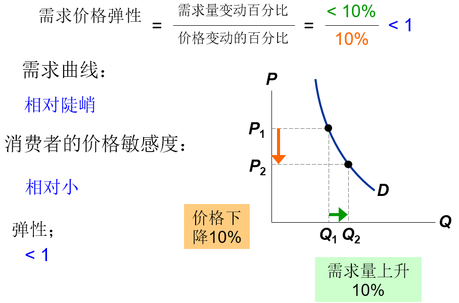

# 弹性及其应用

## 弹性

定义：

弹性衡量需求量或供给量对其某种决定因素的反应程度的指标

## 需求价格弹性

$$
需求价格弹性={需求量变动半分比\over价格变动百分比}
$$

**需求价格弹性**衡量一种物品需求量对其价格变动反应程度的指标

简单地说，它衡量卖者需求的价格敏感程度

例如：

$$
需求价格弹性={15\%\over10\%}=1.5
$$

需求与价格沿着需求曲线往相反方向变化，这使需求价格弹性为负，我们去掉负号，把所有价格弹性表示为正数

### 计算变动百分比

$$
{{终值-初始值}\over初始值}\times100\%
$$

**问题**：

如果初始值不同，计算结果不同

因此采用中点法计算弹性：

$$
{{终值-初始值}\over中点}\times100\%
$$

中点是初始值与终值的平均值

### 需求价格弹性由什么决定

需求价格弹性取决于：

- 相近替代品的可获得性

- 物品时必需品还是奢侈品

- 物品的定义是宽泛还是狭义

- 时间框架——长期比短期更富有弹性

### 各种需求曲线

需求价格弹性与需求曲线的斜率密切相关

- 拇指规则：

  - 通过某一点的需求曲线越平坦，需求的价格弹性就越大

  - 通过某一点的需求曲线越陡峭，需求的价格弹性就越小

#### 需求曲线的五种分类

分类|图像
:-:|:-:
“完全无弹性的需求”（极端）|
“缺乏弹性的需求”|
“单位弹性需求”|
“富有弹性的需求”|
“完全有弹性的需求”（极端）|

#### 线性需求曲线的弹性

线性需求曲线的斜率为常数，但其弹性不是常数

### 总收益与需求价格弹性

$$
需求价格弹性={需求量变动半分比\over价格变动百分比}
$$

$$
收益=P\times{Q}
$$

- 如果需求是富有弹性的，那需求价格弹性>1

  - 即需求量变动百分比>价格变动百分比

  - 需求量减少使收益减少的幅度大于价格上升使收益增加的幅度，总收益减少

- 如果需求是缺乏弹性的，那需求价格弹性<1

  - 即需求量变动百分比>价格变动百分比

  - 需求量减少使收益减少的幅度小于价格上升使收益增加的幅度，总收益增加

## 供给价格弹性

$$
供给价格弹性={供给量变动百分比\over价格变动百分比}
$$

**供给价格弹性**衡量一种物品供给方对其价格变动反应程度的指标

简单地说，它测量了卖者了解价格的敏感度

这里继续使用[中点法](#计算变动百分比)计算变动的百分比

例如：

$$
供给价格弹性={16\%\over8\%}=2.0
$$

### 各种供给曲线

供给价格弹性与供给曲线的斜率密切相关

- 拇指规则：

  - 通过某一点的供给曲线越平坦，供给的价格弹性就越大

  - 通过某一点的供给曲线越陡峭，攻击的价格弹性就越小

#### 供给曲线的五种分类

分类|图像
:-:|:-:
“完全无弹性的供给”（极端）|
“缺乏弹性的供给”|
“单位弹性供给”|
“富有弹性的供给”|
“完全有弹性的供给”（极端）|

### 供给价格弹性的决定因素

卖者越容易改变他们的生产数量，供给价格弹性越大

- 例如：海滨别墅的供给较难改变，因此其供给弹性要低于新汽车的供给弹性

对许多物品而言，长期供给价格弹性都要大于短期供给价格弹性，这是因为企业在长期能建更多的工厂，或者新的企业能够进入市场

### 供给价格弹性会如何变动

由于生产能力限制，当供给量越大时，供给价格弹性越小：

## 其他弹性

### 需求收入弹性

**需求收入弹性**：衡量消费者收入变动时需求量如何变动

$$
需求收入弹性={需求量变动百分比\over收入变动百分比}
$$

>对正常的物品而言，收入增加时，需求量增加也会增加

因此正常物品的需求收入弹性>0

低档物品的需求收入弹性<0

### 需求的交叉价格弹性

**需求的交叉价格弹性**：衡量一种物品需求量对另外一种物品价格变动的反应程度

$$
需求的交叉价格弹性={物品1的需求量变动百分比\over物品2的价格变动百分比}
$$

替代品的交叉价格弹性>0

- 例如牛肉价格上升使对鸡肉的需求增加

互补品的交叉价格弹性<0

- 例如计算机价格上升使对软件的需求减少
