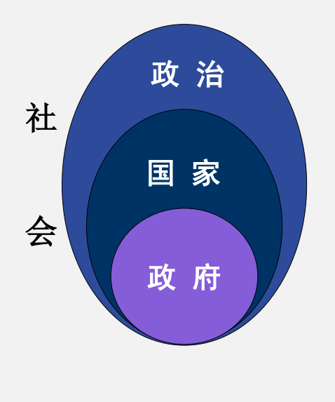
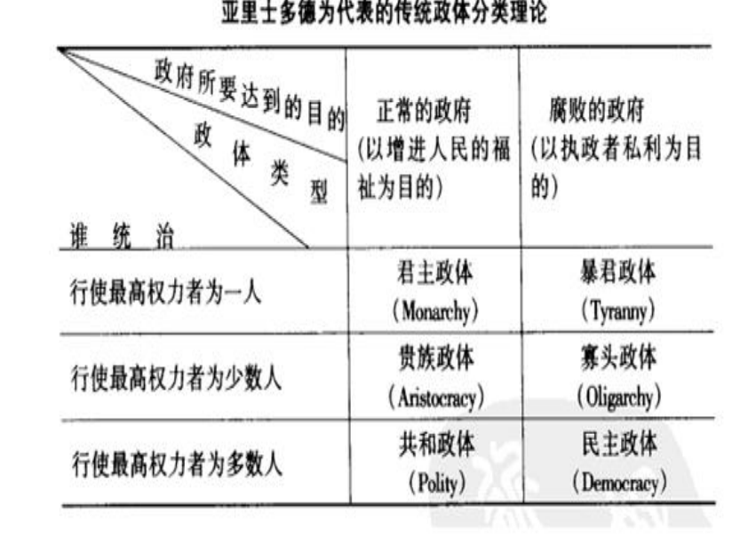
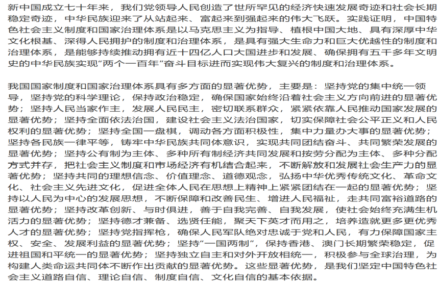
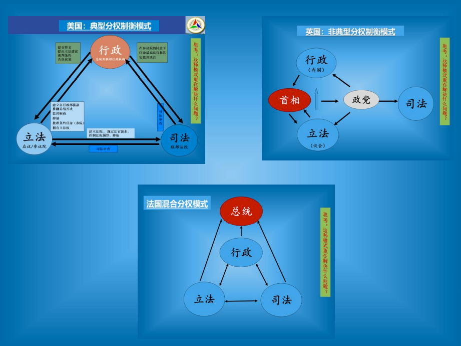
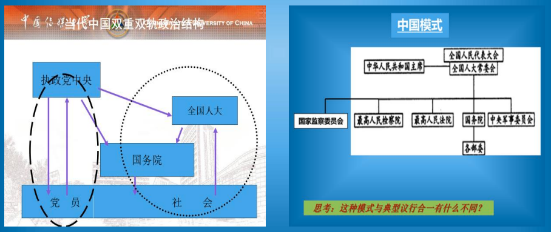
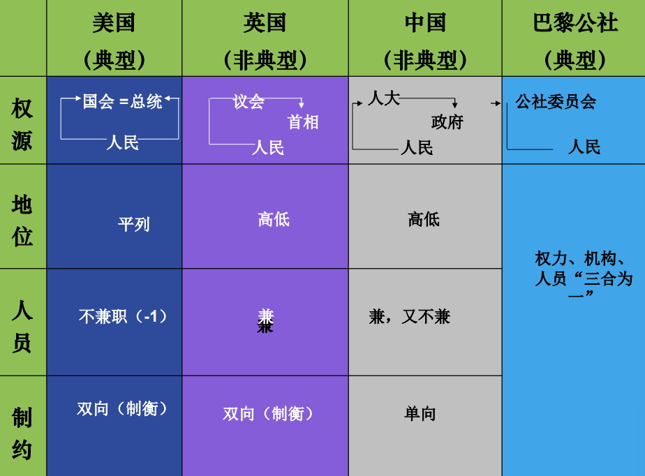

# 政府结构与政治制度

>**[中共中央关于坚持和完善中国特色社会主义制度 推进国家治理体系和治理能力现代化若干重大问题的决定](https://www.chinacourt.org/article/detail/2019/11/id/4610249.shtml)**  
>（2019 年 10 月 31 日中国共产党第十九届中央委员会第四次全体会议通过）  
>为贯彻落实党的十九大精神，十九届中央委员会第四次全体会议着重研究了坚持和完善中国特色社会主义制度、推进国家治理体系和治理能力现代化的若干重大问题，作出如下决定。

>问题1：  
>如何区分“国家”/“政府”？

+ 为什么要区分？

+ 怎么区分？

+ 真的能分开吗？

## 政府

对政府概念的理解，离不开“机构”

广义的政府包括各类国家权力机关在内，即政府是一个国家的立法、行政和司法等机关的总称。 狭义的政府仅仅是指国家机关中执掌行政权力、履行行政职能的行政机关。

**政治学所讲的政府是广义的政府，即对所有国家权力机关的统称**，它主要包括国家元首(the chief of state)、议 会 (assembly) ， 行 政 机 关 (executive) 和 司 法 机 关(judiciary) 、 官 僚 (bureaucracies) 、 军 队 和 警 察(militaries and police forces)等。

## 国家与政府的概念辨析

### 国家与政府的联系

1. 政府是国家最为重要的构成要素。没有政府，国家也就不复存在

2. 政府是国家的主权代表和具体形态

3. 国家以政府为组织标志，政府是实现国家目标的组织手段

### 国家与政府的区别

1. 政府是国家构成要素之一，而非国家的全部

2. 政府权力受之于国家主权，但并不等于国家主权

3. 政府的功能是国家功能的体现，但政府的功能并不同于国家功能

4. 政府的合法性层次低于国家

5. 就其组织构成来看，国家是由统治阶级成员和非统治阶级成员共同构成的，而政府不包含非政府的其他社会成员

**美国政治学家利普 森（Lipson）（1912-2000）（《政治学的重大问题》，刘晓等译，华夏出版社2001，P43）用一个非常简单、直观的图示表示了政治、国家和政府的关系：**

***

>问题2：  
>如何区分“君主制”/“共和制”？

+ 对国家的理解，离不开“制度”的概念

### “政治制度”

类型：君主制 VS 共和制

划分的标准有两个:

1. 最高国家权力执掌者人数的多少

2. 最高国家权力执掌者的产生方式和任职期限

#### 君主制

君主制是指以世袭和终身任职的君主（国王、皇帝、沙皇、大公、苏丹、埃米尔）等为国家元首，并由君主全部或部分、实际或形式地执掌国家最高权力的国家管理形式。

君主制主要有专制君主制和立宪君主制两种。

+ [文莱国家概况](https://baike.baidu.com/item/%E6%96%87%E8%8E%B1) 专制君主制 苏丹

+ [科威特](https://baike.baidu.com/item/%E7%A7%91%E5%A8%81%E7%89%B9/130417) 二元君主制 埃米尔

+ 马来西亚 立宪君主制（轮值君主制） 苏丹

+ 卢森堡大公国 立宪君主制 大公

##### 立宪君主制（Institutional Monarchy)

亦称有限君主制, 是资产阶级国家以君主为国家元首，但君主的权力按宪法规定受不同程度限制的政权组织形式。

建立立宪君主制的国家，往往是在资产阶级革命进行得不彻底的地方,其实质是资产阶级与封建势力妥协的产物,由于各国情况不同，君主的实际权力和地位差异很大。

根据君主实际权力和地位的差异，立宪君主制又分为二元制和议会制两种形式。

##### 二元君主制

是指政府在形式上对君主负责，君主保有很大权力,其行为不受议会约束，并有钦定宪法的国家。

二元君主制一般存在于封建势力强大，资产阶级政治力量相对弱小的国家。1871～1918年的德意志帝国和1889～1945年的日本是二元君主制的典型国家。

二元君主制的特点:

+ 君主是国家真正的权力中心;

+ 君主控制着行政机构;

+ 君主为最高军事统帅,也是对外政策的最高决策者。

##### 议会君主制

议会是国家最高权力中心,政府由议会产生，君主受到宪法和议会的实际限制，一般只具有国家象征意义,议员由选举产生，并有一定的任期，而君主则是世袭的终生任职。

这种政体往往是资产阶级革命较早而又进行得不够彻底的国家。第二次世界大战后，实行这一政体的国家除英国外，还有西班牙、葡萄牙、荷兰、卢森堡、比利时、瑞典、挪威、加拿大、日本、泰国、马来西亚等。

#### 共和制

共和制是国家最高权力机关和国家元首都由选举产生，并有一定任期的国家政体形式，它是当今发达国家普遍实行的政体。

由于各国的议会与总统谁占主导地位的情况不同,可分为议会共和制、总统共和制、混合制、委员会制。

社会主义国家的共和制类型主要包括：巴黎公社、苏维埃制和人民代表大会制等形式。

### 国家权力在纵向上的配置——国家结构形式

国家结构形式是指国家整体与部分之间的关系的基本模式，也就是一个国家的各个组成部分以什么形式和方式整合为一个整体的问题。

国家结构形式包括两种类型：

1. 单一制

   + 中央集权——地方自治

   + 中央集权——非地方自治

2. 复合制

   + 分散型：邦联制

   + 集中型：联邦制——均衡性与非均衡性

#### 单一制

这是由若干行政区域构成单一主权的国家结构形式。单一制国家具有以下特点：

1. 全国只有一个最高立法机关和统一的行政机关体系，中央政权机关对地方政权机关实行集中统一的领导；

2. 全国只有一部宪法和统一的法律体系；

3. 国家主权高度统一。即在对外关系上，只有统一的国家才是国际法的主体，对外代表国家行使国家主权的只有中央政府，地方任何政权机关不享有外交权；

4. 公民具有统一的国籍。

*简言之，在单一制国家里，中央政府享有较大权力，地方要服从中央。*

#### 联邦制

这是指由若干个相对独立的政治实体（共和国、州、邦）联合组成统一国家的国家结构形式。

根据组成联邦制国家的政治实体的成分不同，联邦制国家可以分为两类：

+ 一类是以地方自治实体为基础组建的联邦制国家，如美国、德国。这类联邦制不受民族关系的直接影响，因而其统一性和稳定性较强。

+ 另一类是以民族自治实体为基础组建的联邦制国家，如前苏联、前南斯拉夫等。这种联邦制受民族关系影响较大，如果民族关系处理不好，容易导致联邦制国家的瓦解。

联邦制国家具有以下特点：

1. 具有双重国家机关体系。全国有最高的立法、行政、司法机关，联邦的各组成单位也有自己的立法、行政和司法机关。

2. 具有双重的法律体系。全国有统一的宪法和法律，同时联邦各组成单位也有自己的宪法和法律。

3. 在对外关系上，联邦政府是国际法的主体，享有外交权。同时，联邦的某些组成单位如共和国，在联邦宪法允许的范围内，也享有部分国家主权。

4. 以民族自治实体为基础组建的联邦制国家，每个公民都享有所在成员国和联邦的双重国籍。

*简言之，在联邦制国家，作为联邦组成单位的各政治实体，享有比较充分的管理自身事务的权力。*

#### 我国的国家结构形式

总的原则：**在中央的集中统一领导下，充分发挥地方的主动性和积极性**。这表明中国实行***单一制***的国家结构形式。

国家在少数民族聚居区实行**民族区域自治制度**，在香港、澳门、台湾设立特别行政区，实行
**“一国两制”**。

>中共中央关于坚持和完善中国特色社会主义制度 推进国家治理体系和治理能力现代化若干重大问题的决定  
>（2019年10月31日中国共产党第十九届中央委员会第四次全体会议通过）  
>

***

>问题3：  
>如何理解现代国家机构的构成与分工？

## 现代国家机构的构成与分工

国家机构是实现国家权力,执行国家职能,进行国家日常活动按照一定的原则组建的各种机关的总和，它是政治权力的组织实体体现。

### 国家机构的主要构成与分工

1. 国家元首

2. 立法机关（或称国家权力机关。如：我国的人民代表大会）

3. 国家行政机关（或称国家管理机关。如：国务院，人民政府）

4. 司法机关（或称法院和检察机关）

5. 武装力量——主要指军队、警察、监狱等国家暴力机关

“国家机构”歧义较少，“政府”概念分为五种：

1. 最狭义，指“内阁”。如日本

2. 指国家行政机关。多数国家

3. 指国家机构总体。

4. 国家机构总体 + 执政党。不单是社会主义国家，西方也有。

5. 国家机构总体 + 执政党 + 最高宗教领袖集团。极少数国家，如伊朗。

### 现代国家机构的设置原则

+ 分权制衡原则

+ 议行合一原则

*思考：如何理解我国政权组织原则—“民主集中制”？*

#### 分权制衡原则（“三权分立与制衡”原则）

所谓三权分立指的是：立法权，行政权,司法权三种国家权力,分别由三种不同的国家机关掌握，三种权力既相互独立，又相互制约。

它包含两个内容：其一是权力的分立；其二是权力的制衡。

它是西式民主政治的基本原则。

#### 议行合一原则

是社会主义国家机构的组织原则。

它是由一个最高国家权力机关统一行使立法权和监督权，行政机关和司法机关从属于国家权力机关的组织原则,其理论依据是:一切权力属于人民。

##### 巴黎公社：典型议行合一模式

1871年成立的巴黎公社，实行直接选举，由人民群众直接选出86名代表，组成立法与行政统一的公社委员会。公社委员是按普遍、平等的原则由巴黎20个区的选民直接投票产生的。它设立相当于政府各部的10个委员会，即执行、财政、军事、司法、公安、粮食、劳动与交换、对外关系、社会服务和教育委员会，领导各行政部门，各委员会由5-8人组成，公社委员兼任各委员会委员，实行集体领导，公社制定的各种法令，各行政部门必须执行。巴黎各区选出的公社委员还领导该选区的区政府，直接执行各项法令，并监督执行的情况。巴黎公社的议政合一制和资产阶级的三权分立制不同，它实现了立法权和行政权的统一，公社是同时兼管行政和立法的工作机关。

## 政府类型

资产阶级的中央政府采取何种形式是由该国的政体决定的,有什么样的政体,就会采取什么形式的中央政府。

现代资产阶级国家的中央政府机关主要有四种:

+ 内阁制（“议会内阁制”）

+ 总统制

+ 混合制（“半总统半议会制”）

+ 委员会制

划分的标准：立法机关与行政机关关系的不同

### 中国模式

#### 关于我国政权组织原则“民主集中制”的理解

民主集中制由列宁最早提出，概括地说，就是民主基础上的集中和集中指导下的民主相结合。它既是党的根本组织原则，也是群众路线在党的生活中的运用。

民主集中制在我国国家机构设置中的体现：

+ 国家机关的组成遵循民主原则；

+ 国家权力机关的运行采用民主机制；

+ 国家权力的行使贯彻集中要求。

### 比较后的结论

美：典型的三权分立（互相制衡）体制

英：非典型（带有“议行合一”色彩）的三权分立体制

中：非典型（带有某些“分权”色彩）的议行合一体制

巴：典型的议行合一体制

>四体制评说：  
>各有逻辑  
>互有异同  
>均有距离  
>何有优劣？

*思考：如何从“制度”的角度去理解香港问题？*

香港特别行政区的政治体制是行政长官负责制，即行政主导、司法独立、行政与立法既相制约又相配合。
