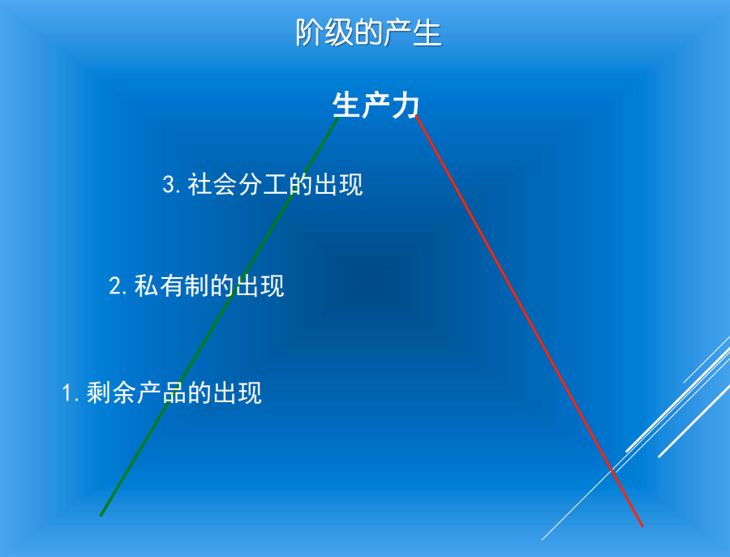
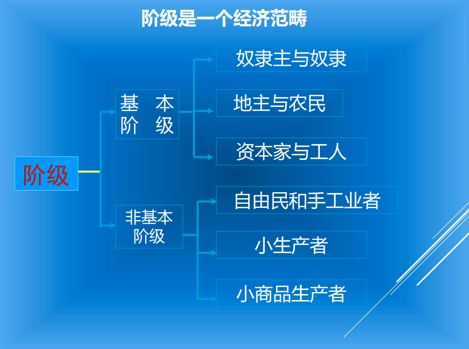
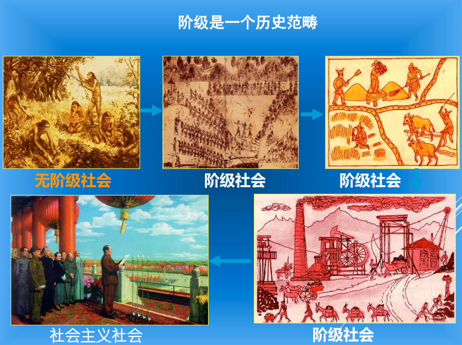
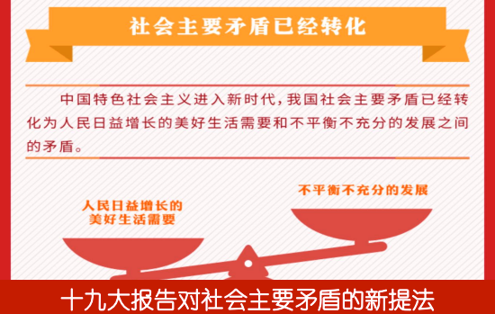

# 政治学视野中的阶级与阶层

>问题1：  
>如何理解阶级概念和阶级分析方法在政治学理论体系中地地位？

## 关于“阶级”的基本理解

### 阶级的起源

**阶级是特定时代的生产方式的产物。**

剩余产品的出现——私有制的出现——社会分工的出现

>“阶级的存在仅仅同生产的一定历史阶段相联系”  
>--马克思

从阶级差别的最初萌发到阶级的产生是一个漫长的历史过程，主要是通过三个途径进行的：

+ 其一，氏族酋长、军事首领和一些公职人员依靠他们的权力和地位，将一些剩余产品占为己有从而形成氏族显贵。

+ 其二，由于社会分工和商品交换的发展，财产不平等现象日益扩大，氏族内部逐渐分化出一些富裕的家庭，拥有较多的生产资料或其他财富，成为氏族内部的富人。

+ 其三，通过战争把俘虏变为奴隶。

>“所谓阶级，就是这样一些集团，由于它们在一定社会经济结构中所处的地位不同，其中一个集团能够占有另一个集团的劳动。”  
>——列宁

### 阶级的经典定义

提出明确的阶级定义的任务是由列宁完成的。列宁给阶级下了一个完整的定义：

> “所谓阶级，就是这样一些大的集团，这些集团在历史上一定社会生产体系中所处的地位不同，对生产资料的关系（这种关系大部分是在法律上明文规定了的）不同，在社会劳动组织中所起的作用不同，因而领得自己支配的那份社会财富的方式和多寡也不同。所谓阶级，就是这样一些集团，由于它们在一定社会经济结构中所处的地位不同，其中一个集团能够占有另一个集团的劳动。”  
>--《列宁选集》第4卷，人民出版社1972.10

+ 总之，在列宁看来，阶级就是指与特定生产关系相联系的，在经济上处于不同地位的社会集团。对生产资料的占有情况是阶级划分的最基本标志，是阶级的最根本特征。

+ 从阶级的定义和特征看，阶级是在一个特定的社会领域——经济领域中形成的，是一个客观存在着的经济实体。相应地，阶级的概念作为对人们这种经济关系的理论概括，必然首先是一个特定的经济范畴。

### 阶级是一个经济范畴

>“相互斗争的社会阶级在任何时候都是生产关系和交换关系的产物，一句话，都是自己时代的经济关系的产物。”  
>--恩格斯

### 阶级是一个历史范畴

>阶级的“划分是以生产的不足为基础的，它将被现代生产力的充分发展所消灭。”  
>--恩格斯

>阶级的“划分是以生产的不足为基础的，它将被现代生产力的充分发展所消灭。”  
>--《共产党宣言》

### **需要注意的几个问题**

+ 第一，在阶级形成的过程中，“不成熟的阶级”和“成熟的阶级”是有区别的。

    +所谓“不成熟的阶级”，是指它赖以存在的经济基础已经形成，作为一个社会群体已经出现，但是还没有意识到自己的根本利益，或者是被社会的整体环境一时抑制，而没有建立自己的阶级组织。

  + 所谓“成熟的阶级”，是指它已经意识到了自己的根本利益，冲破了社会整体环境对自己的抑制，并且在政治上组织起来。在现代社会，这一点主要表现为组织了自己的政党，从而能够以阶级整体的方式进行阶级斗争，这才是完全意义上的阶级。

    + 一个“成熟的阶级”必然有其政治属性，但这种政治上的“成熟”是以它在经济上的“成熟”为条件的。一个阶级的政治属性终究是以该阶级的经济特性为基础的。

+ 第二，社会成员的“个体的阶级划分”与“群体阶级归属”是有区别的。

  + “阶级斗争扩大化”问题的形成及其后果，都是由于把“阶级是一个政治范畴和思想范畴”的错误结论应用于阶级划分，也即应用于给社会成员确定所谓“出身”和“阶级成分”，这在理论上和实践上都是绝对错误的。一个人的“出身”是客观存在的，但划分的标准只能有一个，即列宁阶级定义的第二条。

+ 第三，“阶级划分”与“阶级分析”是有区别的。

  + 阶级划分的唯一标准是阶级的经济地位，而阶级分析作为一种思考政治问题的方法，必须是多方面、多角度的。

>问题2：  
>如何理解阶级概念与阶级理论在今天的适用性？

## 阶级与阶层

社会阶层的核心内容是社会资源和社会机会在不同社会群体中的分配方式或配置方式的差异。这就是社会学领域中社会分层研究的主要视角。

阶级与阶层都是从社会资源和社会机会在不同社会群体中配置的角度出发的。

马克思主义的阶级概念着重强调社会分工、生产资料的占有、财产所有制，特别是生产资料的占有的决定性意义。而生产资料就是一种重要的社会资源，尽管不是唯一的社会资源。

**两者的区别在于，它们的包含关系不同。**

+ 一种理解是——传统政治学角度：阶级是个大概念，阶层是个下属概念，即每个阶级下面按照不同的标准再分若干个阶层。

+ 另一种理解是——社会学角度的理解：阶层（stratum）是个大概念，而阶级（class）则是一种特殊的分层。为什么这样说？因为阶层是按一般的概念“社会资源和社会机会”来区分的，而阶级则是一种按特殊的社会资源―――生产资料来分层的结果。所以在社会学中，阶级被纳入分层或层化（stratification）的范围之中，分层或层化是个大概念。

按照第一种理解，阶层有两层含义：

+ 其一，指同一阶级内部按照经济地位或其他标准划分成的若干层次，如资产阶级中有工业资本家、商业资本家、金融资本家；

+ 其二，指阶级范围以外的社会集团的划分，即按照特定的标准把各阶级中的部分成员联合起来而构成的社会的特殊部分，如知识分子阶层就是按照劳动分工的原则划分的。

上述两点说明，阶层在某些特征上与阶级可能有一致的方面，也可能有不一致的方面。

从上述根本点来看，在当前，阶层范畴可以看作是一种适度淡化了的阶级概念。

在现阶段我国所处的内外环境中，用阶层范畴来适度淡化阶级概念，不仅是必要的、及时的，而且是符合我国社会差异的实际的，也是符合马克思主义对待两种社会应取不同态度的要求的。

## 阶级与等级

在阶级社会中还有等级的区分。如奴隶社会和封建社会中曾经存在过天子、诸侯、大夫、士、庶人这些等级。

在中国和在西方，古代社会中的“阶级”，就是指社会上存在的身份等级。在中国的古典文献中，“阶级”既指官位俸禄的等级，也指社会伦理制度“礼”规定的等级秩序。

>《新书·阶级》西汉贾谊曰：“故古者圣王制为列等，内有公卿大夫士，外有公侯伯子男……**等级分明**。”

>《三国志·吴志·顾谭传》西晋史学家陈寿曰：“臣闻有国有家者，必明嫡庶之端，异尊卑之礼，使高下有差，**阶级逾邈。**”

没有官位的“老百姓”，在古代通称为“庶民”。“士”介于“大夫”和“庶民”之间，有的是拿俸禄的“食邑”的官，也有的是自食其力的“食田”的民。所以古时有“士大夫”和“士民”的称谓，但后来“士”通指“读书人”。

在中国古代传统的农业社会，“民”的划分是“士民、农民、工民、商民”四民。《汉书·食货志》曰：“士、农、工、商，四民有业；学以居位曰士。”

在西方过去有文字的各个历史时代，社会等级制度也是普遍存在的，可以看到由各种社会地位构成的多级的阶梯。

+ 在古罗马，有贵族、骑士、平民、奴隶；

+ 在中世纪，有封建领主、陪臣、行会师傅、帮工、农奴；

+ 而且在每一个阶级内部又有各种独特的第等。

### 等级与阶级的区别在于

+ **等级比阶级的外延狭窄。**

  + 等级比阶级的外延狭窄。

    + 阶级是一个经济范畴，反映的是人们之间的经济关系，

    + 等级则是按照地位、身份、门第、职业对社会成员所进行的划分，反映的是人们之间的政治法律关系。

+ **阶级与等级又有联系。** 在奴隶社会和封建社会，阶级表现为一些特别的等级。

+ **阶级关系往往被等级关系所掩盖。**

### 关于“阶级斗争”

**阶级斗争是指经济利益根本对立的阶级之间的对抗和冲突，即剥削与被剥削、压迫与被压迫阶级之间的对立和斗争。**

阶级斗争的根源就在于不同阶级在一定经济关系中所处地位的根本对立，在于他们经济利益上的相互冲突。

**对阶级斗争的研究和关注，是法国和英国近代史学的新传统。**

此前，史学界解释历史变迁的主流观念是：

+ **在一切历史变动中，最重要的、具有决定意义的是政治变动**，而这种变动的最终原因，应当到支配人们**个体理性选择或集体行动的思想动机**中去寻找。

法国和英国近代的部分史学家，对这种观念提出了挑战，他们的研究证明：

+ 欧洲历史的动力，至少从中世纪起，是新兴资产阶级为争取社会和政治的统治同封建贵族所作的斗争，并由此形成了**“市民社会”理论**和史学的新学派。

**马克思在此基础上进行了新的理论变革。**

他证明，在充分认识社会经济状况的条件下，一切历史现象都可以用最简单的方法来说明，而每一历史时期的观念和思想也同样可以极其简单地由这一时期的生活的经济条件以及由这些条件决定的社会关系和政治关系来说明。也就是说，一切历史的真正基础是经济，人们首先必须吃、喝、住、穿，然后才能争取统治，从事政治、宗教、哲学等等。在此基础上的阶级斗争，是历史的真正动力；而从19世纪开始，随着大工业的产生和推进，阶级对立简单化了，整个社会日益分裂成两大敌对的阶级，即资产阶级和无产阶级。

*马克思主义不同于一般的理论，因为它是革命的实践学说。*

在阶级矛盾激化的19世纪以及随后的时期，马克思的学说得到快速而广泛的传播。

在中国，马克思主义成为中国共产党产生的指导学说，马克思关于阶级斗争的理论，成为中国共产党通过革命运动夺取政权的指导思想。

但是，在社会主义和平建设时期，特别是在“反右派”和“文化大革命”时期，“阶级斗争”被一再地简单化和扩大化，制造了很多人为的“阶级矛盾”。以致于现在人们一听说进行“社会阶层结构分析”，就联想到“划阶级、定成份”，似乎这是个令人谈虎色变的话题。

其实，在现代的社会理论中，“阶级”或“阶层”，都是指按一定标准区分的社会群体（social group）。根据不同的理论和不同的研究目的，也有不同的划分标准和方法。

在过去中国语言里，阶层一般是指阶级内部不同等级的群体或处于不同阶级之间的群体。而现在中国学者更多地使用“阶层”的概念，很大程度上是由于历史的原因，是为了有别于在政治上“划阶级、定成份”的做法。

>问题3：  
>如何理解当代中国社会阶层分化对政治发展的影响？

### 传统资本主义国家的一般阶级结构

>“我们的时代，资产阶级时代，却有一个特点，它使阶级对立简单化了。整个社会日益分裂为两大敌对的阵营，分裂为两大相互直接对立的阶级：资产阶级和无产阶级。”  
>——《共产党宣言》（1848）

***横向：经典判断与今日变化***

### 当代资本主义的新变化

+ 资本占有形式社会化，私营经济与国有经济兼具的混合经济有了较大发展

+ 经济运行有序化，政府与市场两只手都在发挥作用

+ 分配形式兼顾“公平”，税收制度、福利制度与社会保障制度等效果显现

+ 阶级结构复杂化，对抗缓和，结构多元，传统无产阶级呈“中产化”

***纵向：当代中国的阶级、阶层和社会关系***

现阶段的中国社会，仍然处于社会主义的初级阶段，剥削阶级作为一个阶级已经被消灭。但是，还存在着阶级、阶层差别和社会差别以及由此产生的具有不同利益和要求的社会集团，它们构成了我国社会现阶段的阶层结构。

### 中国社会成员构成发展变化的阶段分析

1. 建国初—改革开放前（1949--1978）

    + 建国初期(1949-1952)：局部整合

    + 城乡社会主义改造时期(1953-1957)：反分化的功与过

    + 大跃进、人民公社化时期(1958-1961)：反分化走上极端的恶果

    + 调整时期(1961-1965)：以局部分化整治过度整合

    + “文化大革命”时期(1966-1976)：社会阶层结构被打乱

    + “徘徊中的两年（1976-1978）：基本延续

2. 改革开放前30年（1978—2012）

    + 改革开放的前十年（1978--1988）:“先农村，后城市”

    + “沉默”的三年（1989－1992）：“方向在哪里”

    + 市场化改革中的分化与发展（1992—1999）“大分化，新组合”

    + 市场化纵深推进中的社会分化（21世纪初—2012）“分化”/“固化”/“断裂”？

3. 十八大以来处理社会关系的思路（2013——）

    + **十九大报告对社会主要矛盾的新提法**  
    

### 中国社会阶层分化的基本情况

社会结构或社会的阶级构成是政治学研究的一项主要课题，也是与社会学、经济学在研究领域有诸多交叉的一个分支学科。

作为政治学理论研究，我们始终必须坚持阶级分析方法为核心和基本的方法论。

但是，阶级分析方法并不是社会结构问题的唯一分析方法。必须辅之以其他的研究方法才能全面地剖析和说明一定的社会结构的基本状况。

**为什么要用“阶层分析方法”来补充“阶级分析方法”？**

这是因为，随着经济生活的多样化，社会阶级阶层构成也发生了趋向于多样化的变化。如果说过去的中国，在社会结构上是一个“阶级社会”的话，那么现在就已经变成了一个“阶级”和“阶层”并存的社会，即由“三明治”变成了“千层饼”，分化和组合出了许多新的社会利益群体。

**研究社会阶层构成的目的是什么？**

+ 第一，从政治学角度讲，政治问题说到底是处理社会利益关系问题，而阶层和阶级、民族，是现时代最主要的三大社会利益载体。不研究社会各阶层，就不可能真正了解中国政治。

+ 第二，是为了完成一项有关文化积累。

+ 第三，是为了使各阶层通过了解学术界的研究成果,增强实现现代化的信心,让各阶层都认识到本阶层是现代化建设的重要力量。

**目前阶层关系调整的主要方向是什么？**

+ 一是采取一切可能的政治、政府和法律手段，控制贫富差距的不恰当的扩大，限制贫富差距扩大带来的各种副作用。

+ 二是充分认识城市化在民族复兴和社会进步中的伟大历史意义，充分认识城市化将给中国社会阶层进一步积极分化所可能带来的深远影响，充分理解工人阶级一体化、农民阶级大分化、知识分子扩大化和民工大流转以及不同阶层间的流动在中国社会结构良性调整中的特殊价值。

### 当前中国社会阶层分化的基本情况

1. 不同社会阶层划分类型的出现。

2. 划分社会阶层的标准发生变化。

3. 阶层政治地位发生变化。

4. 社会阶层结构从“金字塔型”发展到“洋葱头型”并逐步向“橄榄型”方向发展。

5. 努力实现各阶层共赢有必要成为新共识。

自改革开放以来，我国社会的阶级结构又发生了一系列新的变化，中国社会科学院2001年12月11日发表的《当代中国社会阶层研究报告》认为当今中国的社会阶层结构已经发生改变。

我国解放初期的“两个阶级一个阶层”（工人阶级、农民阶级和知识分子阶层）的社会结构，已经变成了十大阶层，各阶层之间的社会、经济、生活方式及利益认同的差异日益明晰化。

这十大社会阶层是：国家与社会管理者阶层、经理人员阶层、私营企业主阶层、专业技术人员阶层、办事人员阶层、个体工商户阶层、商业服务人员阶层、产业工人阶层、农业劳动者阶层和城乡无业失业半失业者阶层。

### 对当代中国社会阶层分化的趋势和性质的基本判断

两个问题：

+ 第一，基本趋势：分化不会停，方向很重要

+ 第二，基本性质：从“身份”到“契约”

### 正确调整当前中国社会关系的基本思路

+ 第一，当代中国社会的基本矛盾（如何定位）

+ 第二，正确处理当前中国社会关系的基本思路（如何建构）

社会主义初级阶段主要矛盾于1981年中国共产党第十一届六中全会指出：在社会主义初级阶段，我国社会的主要矛盾是人民日益增长的物质文化需要同落后的社会生产之间的矛盾。

2017年10月18日，习近平同志在十九大报告中强调，中国特色社会主义进入新时代，我国社会主要矛盾已经转化为人民日益增长的美好生活需要和不平衡不充分的发展之间的矛盾。

**基本思路如何构建？**

国内/国际：

+ 新冠疫情

+ 经济下行

+ 局部动荡

+ 不稳定

+ 不确定性

+......

>“今年第一季度极不寻常，突如其来的新冠肺炎疫情对我国经济社会发展带来前所未有的冲击。”
