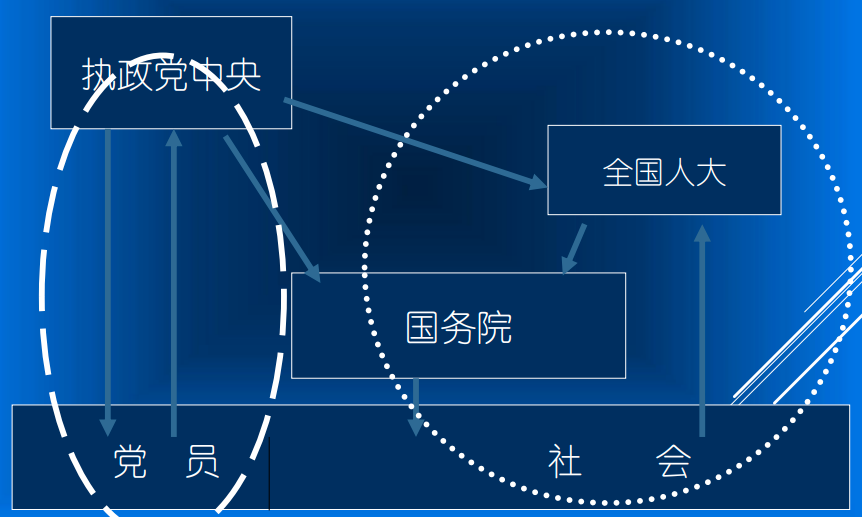
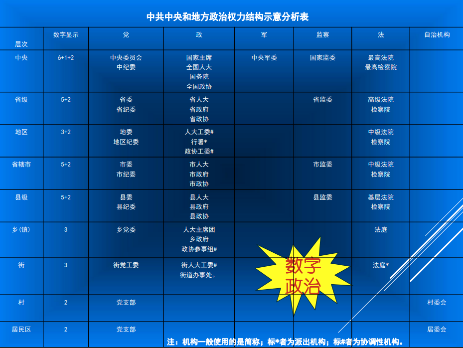

# 政治学通识

## 第一讲 导论

>“政治”引发的思考

### 理解当代中国政治的“关键词”

>“党政体制”与“百年视角”

+ 中国共产党是理解当代中国政治的钥匙

+ “党政体制”是理解当代中国政治的关键词

+ 历史维度的重要性--“三个百年”

### 当代中国双重双轨政治结构

### 中共中央和地方政治权力结构示意分析表

### 我国发展环境面临的深刻复杂变化

||国际|国内|
| :----: | :----: | :----: |
|机遇|当今世界正经历百年未有之大变局，新一轮科技革命和产业变革深入发展，国际力量对比深刻调整，和平与发展仍然是时代主题，人类命运共同体理念深入人心|我国已转向高质量发展阶段，制度优势显著，治理效能提升，经济长期向好，物质基础雄厚，人力资源丰富，市场空间广阔，发展韧性强劲，社会大局稳定，继续发展具有多方面优势和条件|
|挑战|国际环境日趋复杂，不确定性明显增加|我国发展不平衡不充分问题仍然突出，重点领域环节改革任务仍然艰巨，创新能力不适应高质量发展需求，农业基础还不稳固，城乡区域发展和收入分配差距较大，生态环保任重道远，民生保障存在短板，社会治理还有弱项|

### 第十四个五年规划

**全国人大表决通过“十四五”规划**

十三届全国人大第四次会议11日举行闭幕会，“十四五”规划和2035年远景目标纲要获表决通过。至此，中国未来5年至15年发展顶下总路线图与新征程的蓝图以及共同行动纲领。

### 思考：我们可以离开“政治”

**政治是一个不可回避的事实。**

>   “无论一个人是否喜欢，实际上都不能完全置身于某种政治体系之外。一位公民，在一个国家、市镇、学校、教会、商行、工会、俱乐部、政党、公民社团以及许多其他组织的治理部门中，处处都会碰到政治。政治是人类生存的一个无可避免的事实。每个人都在某一时期以某种方式卷入某种政治体系。”

>--（美）罗伯特·达尔《现代政治分析》

### 政治学对我们的意义

专门著有《政治学》的亚里士多德认为*政治学是人类最高的学问*，因为它研究的是**国家之善**的问题，即**如何组织和安排人类社会生活的问题**。

政治之所以引起人们关注，之所以变得“敏感”，是由于人们希望改善自己的生活，期望组织一个良好的社会。但人们却存在着许多分歧。所以说，研究政治意义就在于：

1. 确立共同的政治理念，广泛地形成政治共识

2. 探索合理的政治安排，合理地规划政治生活
 
3. 寻求文明的政治规则，文明地解决政治冲突

4. 参与国际政治活动地需要

所有这些都需要掌握认识和分析政治生活地手段，需要掌握研究政治现实地相应地概念、理论、途径与方法，而这些正是政治学所要和所能提供的东西。

### 赵宝煦：政治学的功能是解决矛盾

>   “政治学要研究革命的理论和策略。因为在阶级对立的社会里，革命是最终解决矛盾的惟一办法。因此可以说，政治学的功能是在国家社会中解决矛盾、化解冲突；在和平发展的社会中，政治学的功能应该不变，仍然是解决矛盾、化解冲突。由于矛盾的性质不同，所以采取的手段也应有所不同。这时，不是用激烈的暴力手段，二十调和矛盾，使矛盾的各方均能有所克制、有所妥协，提出大家都可以勉强接受的办法，从而化解矛盾。我这里不提‘双赢’，因为通常情况下，矛盾对立的双方解决矛盾的办法，可以达到‘双赢’的结果实不多见。而需要提倡的却是妥协精神。”

>--《北京大学学报》2005年第6期
