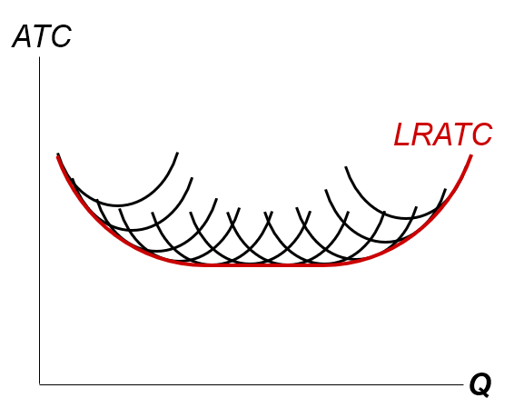
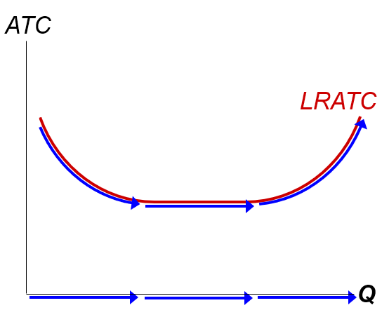

# 生产成本

## 总收益、总成本、利润

假定企业的目标使利润最大化

利润=总收益-总成本

>总收益：企业出售其产品所得到的货币量  
>总成本：企业用于生产的投入品的市场价值

### 显性成本与隐性成本

- 显性成本：需要企业支出货币的投入成本

  - 例如：支付给工人的工资

- 隐性成本：不需要企业支付货币的投入成本

  - 例如：企业所有者时间的机会成本

>经济学十大原理之一：  
>某种东西的成本使你为了得到它所放弃的东西

无论对于显性成本还是隐性成本，这都是正确的，两者对于企业决策都是重要的

### 显性成本与隐性成本：一个例子

你需要\$100,000开始你的业务，利率为5%

- 情形1：借\$100,000

  - 显性成本=\$5000
  
    借款利息

- 情形2：使用\$40,000储蓄，并借\$60,000

  - 显性成本=\$3000(5%)
  
    借款利息

  - 隐性成本=\$2000(5%)
  
    损失了原本可以获得的储蓄\$40,000的利息

在两种情形中，总成本（显性+隐形）都是\$5000

### 经济利润与会计利润

- 会计利润=总收益-总显性成本

- 经济利润=总收益-总成本（包括显性成本与隐性成本）

会计理论没有考虑隐性成本，因此会计利润要大于经济利润

### 生产函数

**生产函数**：用于生产一种物品的投入量与该物品产量之间的关系

#### 边际产量

**投入的边际产量**：在其他投入量不变的情况下，增加一单位投入所引起的产量增加

- 符号：

  Δ(delta)：表示变动量，即差值

>ΔQ：产出的变动量  
>ΔL：劳动的变动量

劳动的边际产量（MPL）=ΔQ/ΔL

劳动的边际产量=生产函数的斜率

#### 为什么劳动边际产量重要

>经济学十大原理之一：  
>理性人考虑边际量

MPL随着L的增加而减少，不管使固定投入使土地还是资本（仪器，机器等等）

- 边际产量递减：

  一种投入的边际产量随着投入量增加而减少的特征（其他条件不变）

#### 边际成本

**边际成本（MC）**：额外一单位产量所引起的总成本的增加：

MC=ΔTC/ΔQ

>TC：Total Cost，即总成本

### 固定成本与可变成本

- 固定成本（FC）：不随着产量变动而变动的成本

  - 例如：设备成本，偿还贷款，租金支付

- 可变成本（VC）：随着产量变动而变动的成本

  - 例如：原材料的成本

- 总成本（TC）=FC+VC

- 平均总成本（ATC）：等于总成本除以产量

  - ATC=TC/Q

  - 另：ATC=AFC+AVC

#### ATC与MC

- 当MC<ATC，ATC减少

- 当MC>ATC，ATC增加

MC曲线从ATC曲线的最低点处穿过ATC曲线（MC曲线与ATC曲线相交于ATC曲线的最低点）

### 短期成本与长期成本

- 短期：

  一些投入的数量是固定的（比如工厂，土地），这些投入的成本是固定成本

- 长期：

  所有投入的数量都是可变的（比如企业可以建造更多的工厂或者出售已建好的工厂）

在长期里，在任何产量的平均总成本都是使用生产那个产量的最有效率的投入成本（比如在平均总成本最低的工厂规模时生产）

#### 一个代表性的长期平均总成本曲线

#### 生产规模变动时平均总成本如何变动

- 规模经济：长期平均总成本随产量增加而减少

  - 规模经济的产生时因为较高的产量水平允许在工人实现专业化：专业化可以使工人更精通某一项工作

    - 在产量低时，规模经济更常见

- 规模收益不变：长期平均总成本在产量变动时保持不变

- 规模不经济：长期平均总成本随产量增加而增加

  - 规模不经济的产生时由于任何一个大型组织中固有的协调问题

    例如：管理团队越庞大，成本控制就越困难

    - 当产量高时，规模不经济更常见

### 结论

- 成本对于许多商业决策而言时异常重要的，包括生产、定价以及雇佣
